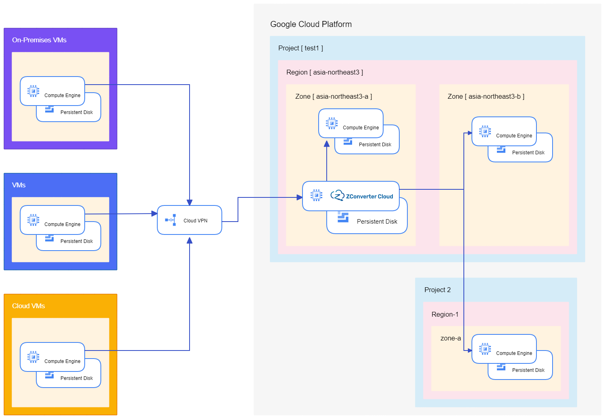
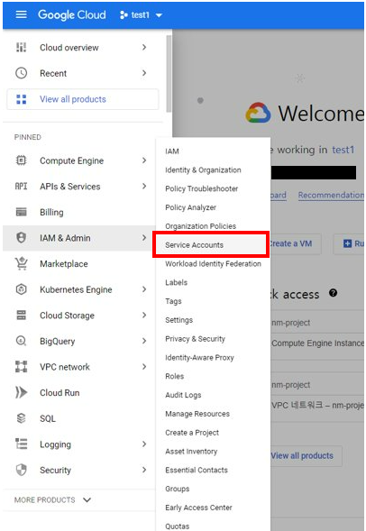
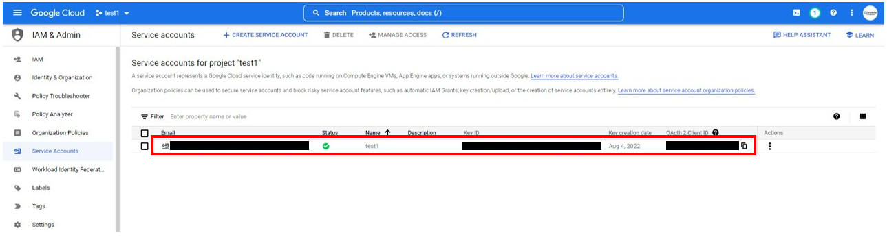
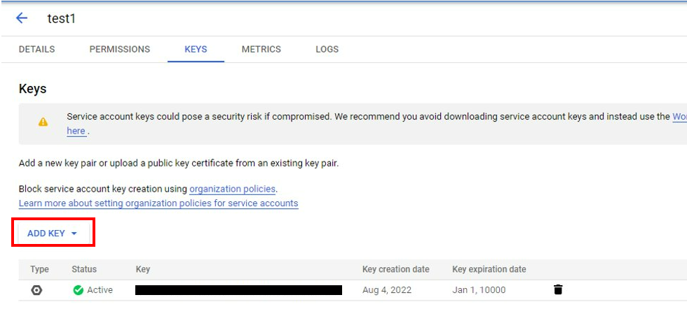
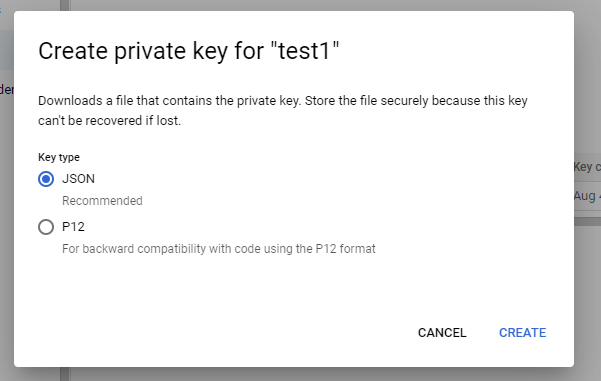

# Create Instance Using Google cloud

---

### Auto Creating Instance Using Gcloud CLI

**gcp_main.exe** enables you to create compute instance automatically by using Google Cloud CLI. 



---

## Before you begin

- You need to prepare a Google Account and enable **Compute Engine API** 
- Install or update to the latest version of the **Google Cloud CLI**

For more information, see [**gcloud API Prerequisites**](https://cloud.google.com/compute/docs/api/prereqs), [**goocle Compute Engine API**](https://cloud.google.com/compute/?hl=en_US&_ga=2.127439885.-1431037956.1657087990&_gac=1.247445878.1658456250.Cj0KCQjw8uOWBhDXARIsAOxKJ2HwOrINrWuvsPqRY6B1P9IDbj1YBFuMmERpr_vx6kTjSa3D1nsni6saAupYEALw_wcB)

### 1. Clone this repository

Create a local copy of this repository:

```
git clone https://github.com/ZConverter/gcloud-auto-create-vm.git
cd gcloud-auto-create-vm
```

### 2. **Installation**

To run gcp_main.exe, install **python**, **gcloud CLI**

See [**how to install gcloud CLI**](https://cloud.google.com/sdk/docs/install)

> Cloud SDK requires Python; supported versions are Python 3 (preferred, 3.5 to 3.8) and Python 2 (2.7.9 or later).
> 

### 3. **Create service account key in Gcloud console**

To authorize the use of a service account key, you will need to save the service account credentials to your local system.

For more information about Service account, see [**Authorizing the gcloud CLI**](https://cloud.google.com/sdk/docs/authorizing)

1. Go to the **Sevice Accounts** page in the Google Cloud console
    
    
    
2. Choose an existing account or create a new accout by clicking **Create service account**.
    
    
    
    choose an existing account
    
3. Create new JSON-formatted key file:
    1. Click **KEYS**
    2. Click the **ADD KEY** drop down menu.
    3. Click **Create new key**
    4. Select a key format **JSON** and then click **Create** (It will be downloaded to your local system)
    5. Move your key file to a folder where you run the gcp_main.exe  
    
    
    
    
    


### 4. **Modify info.json**

For each instance you want to create, modify **info.json** about the values listed below.

- You must specify **credentials_path, vm_name, ssh_authorized_keys.**

1. credentials_path (string)
    
    The name of the credential key file created on the previous step. You must specify it.
    
    > You can create it by using either the [**Google Cloud Console**](https://console.cloud.google.com/) or `gcloud iam service-accounts keys create`. The key file can be **.json (preferred)** or **.p12 (legacy)** format. In case of legacy .p12 files, a separate password might be required and is displayed in the Console when you create the key.
    > 

2. region (`string`)
    
    Region which specifies zone which you want to create the instance. The default region is "asia-northeast3". If you want to display Compute Engine regions in a project, See [**gcloud compute region list**](https://cloud.google.com/sdk/gcloud/reference/compute/regions/list)
    
3. OS and OS_version (`string`)

    The default OS and OS_version is windows-2016.
    Available operating system and version:
    
    | OS | OS version | Matching Image-family |
    | --- | --- | --- |
    | string | string |  |
    | centos | 7 / 8 / 9 | centos-7 / centos-stream-8 / centos-stream-9 |
    | rhel | 7/ 8 / 9 | rhel-7 / rhel-8 / rhel-9 |
    | ubuntu | 16.04 / 18.04 / 20.04 / 22.04 | ubuntu-pro-1604-lts / ubuntu-pro-1804-lts / ubuntu-pro-2004-lts / ubuntu-pro-2204-lts |
    | windows | 2012 / 2016 / 2019 / 2022 | windows-2012-r2 / windows-2016 / windows-2019 / windows-2022 |
    
4. vm_name (`string`)
    
    The name of the resource. To create VM, you must specify vm_name. The name must be unique to the project.
    
    > The resource name must be 1-63 characters long, and comply with [RFC1035](https://www.ietf.org/rfc/rfc1035.txt). Specifically, the name must be 1-63 characters long and match the regular expression `[a-z]([-a-z0-9]*[a-z0-9])?` which means the first character must be a lowercase letter, and all following characters must be a dash, lowercase letter, or digit, except the last character, which cannot be a dash.
    > 
    
5. machine_type (`string`)
    
    Specify the machine type used for the instances. If unspecified, the default type is n1-standard-1.
    To get a list of available machine types, run `gcloud compute machine-types list`. 
    
6. **ssh_authorized_keys** (`string`)
    
    A value of your public SSH key that use OS Login. The key must use the `public-openssh` format.
    
    If unspecified, VMs that use OS Login accept SSH keys that are associated with your Google account. You can add SSH keys to user account using Google Cloud console. For more information, see [**Add SSH keys to VMs**](https://cloud.google.com/compute/docs/connect/add-ssh-keys#gcloud_1)
    
7. volume (list)
    
    The size of additional persistent disks to be created and attached to the instances. Disk size must be a multiple number of 1 GB. The default size is 100. This persistent disk will be automatically deleted when the instance is deleted.
    > By default, each Compute Engine instance has a small boot persistent disk that contains the operating system. 
    
8. user_script (string)
    
    A startup script in a local file. The script will be executed by the instances once it starts running. 
    You can use one of the following formats: 
    
    **for Windows**
    
    ```
    <script>
    .....
    </script>
    ```
    
    **for Linux**
    
    ```
    #! /bin/bash
    ...
    ```
    
9. tags (`string`)
    
    Name and target tags of the firewall rules. The firewall rule applies only to instances with this tags. The tags must be unique to the project. 
    

10. firewall_rule (list)
    
    A list of protocols and destination ports to allow inbound rules. The rules are created in the `default` network. To use firewall_rule, you must specifiy tags. For more information, see **[VPC firewall rules overview](https://cloud.google.com/vpc/docs/firewalls#direction_of_the_rule)**
    

**Example JSON**

```json
{
    "generate":{
        "cloud_platform": "gcp",
        "auth":
          { 
            "credentials_path":"credentials.json", # 1.
            "region":"asia-northeast3" # 2. 
          },
        "vm_info": 
          {
            "OS" : "windows", # 3. 
            "OS_version" : "2019", # 3. 
            "vm_name" : "zcm-test", # 4. 
            "machine_type" : "e2-medium", # 5. 
            "ssh_authorized_keys" : "ssh-rsa .....", # 6. 
            "volume" : [100], # 7. 
            "user_script":"win_script.ps1", # 8. 
            "tags":"zcm-vm" # 9. 
	    "firewall_rule":[
              "tcp:3389","tcp:139",... # 10.
            ]
        }
    }
}
```

---

## 5. Create compute instance

1. Go to the folder where you run gcp_main.exe
2. Run the following commands:

```
gcp_main.exe --info_json info.json
```

Takes a short period of time for the instance to start. After the instance is ready, you can see a log about VM instances. You can connect to a VM using following log.
- If you are unable to connect Windows VMs, please wait a few more minutes and then try again.
- For Linux VM,  you can log in using private key.

**Example Log**
For Windows:
```
{
        "instance": {
                "Name": "test",
                "Public IP": "**.**.***.***",
                "Login": {
                        "Id": "user-test",
                        "Password": "********"
                }
        }
}
```

For Linux:
```
{
        "instance": {
                "Name": "test",
                "Public IP": "**.**.***.***",
                "Login": {
                        "Id": "user-test"
                }
        }
}
```

---

## Example Scenario

Create an Windows 2016 VM instance

- OS: windows-2016
- zone: asia-northeast3-a
- Machine type: n1-standard-1
- Firewall: allow tcp traffic of 3389, 139, 445, 50000, 50001, 50002, 50003 ports
- Pesistent Disk: 100 GB

```json
{
    "generate":{
        "cloud_platform": "gcp",
        "auth":
          { 
            "credentials_path":"credentials.json",
            "region":"asia-northeast3"
          },
        "vm_info": 
          {
            "OS" : "windows",
            "OS_version" : "2016",
            "vm_name" : "test1",
            "machine_type" : "",
            "ssh_authorized_keys" : "ssh-rsa AAAA...",
            "volume" : [100],
            "user_script":"win_script.ps1",
            "tags":"zcm-vm",
            "firewall_rule":[
              "tcp:3389","tcp:139","tcp:445","tcp:50000","tcp:50001","tcp:50002","tcp:50003"
            ]
        }
    }
  }
```

Create a CentOS-8 VM instance

- OS: centos-8
- zone: asia-northeast3-a
- Machine type: e2-medium
- Pesistent Disk: 50 GB

```json
{
    "generate":{
        "cloud_platform": "gcp",
        "auth":
          { 
            "credentials_path":"credentials.json",
            "region":"asia-northeast3"
          },
        "vm_info": 
          {
            "OS" : "centos",
            "OS_version" : "8",
            "vm_name" : "test2",
            "machine_type" : "e2-medium",
            "ssh_authorized_keys" : "ssh-rsa AAAA...",
            "volume": [50],
            "user_script":"lin_script.sh",
            "tags":"",
            "firewall_rule":[]
        }
    }
  }
```
